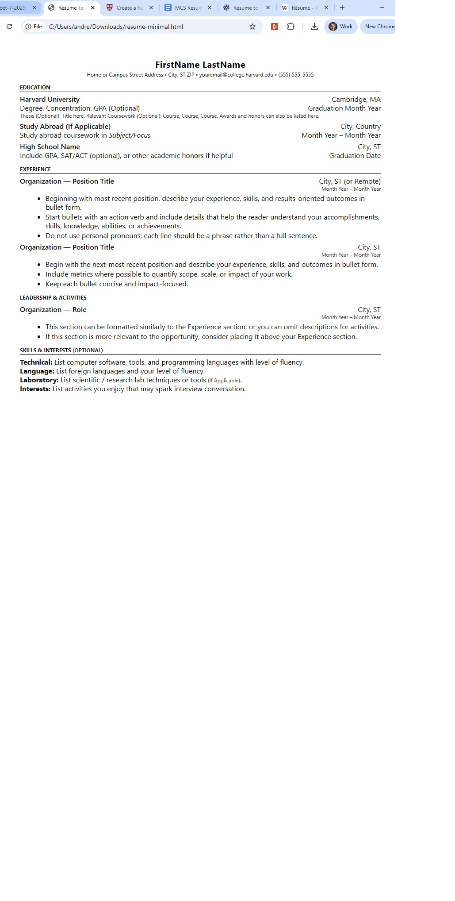

# Frontend Technical Specification

- Create a static website that serves an html resume.

## Resume Format Considerations

I live in Canada and resumes in word/pdf format are suppose to exclude information. eg. Age, Relationship. Canada resume don't often include GPA grades.

In Canada we use a similar format of resume common in the US.

I'm going to use the [Harvard Resume Template format](https://careerservices.fas.harvard.edu/channels/create-a-resume-cv-or-cover-letter/#uc_resource_tiles-4) as the basis of my resume.

### Harvard Resume Format Generation

I know how HTML very well, so I'm going let GenAI do the heavy lifting
and generate out html HTML and possibly CSS and from there I will manually refactor the code
to preferred standard.

Prompt to ChatGPT 5:

```text
Convert this resume format into html.
Please don't use a css framework.
Please use the least amount of css tags
```

Image provided to LLM:


This is [generated output](./docs/oct-7-2025-resume-minimal.html) which I will refactor.

This is what the generated HTML looks like unaltered:



## HTML Adjustments

- UTF8 will support most langauges, I plan to use English and Japanese so we'll leave this meta tag in.
- Because we will be applying mobile styling to our website  we'll include the viewport meta tag width=device-width so mobile styling scales normally.
- We'll extract our styles into its own stylesheet after we are happy with our HTML markup
- We'll simplfy our HTML markup css selector to be as minimal as possible.
- For the HTML page I'll use soft tabs two spaces because I mostly code in Ruby and that's the standard tab format.

## Serve Static Website Locally

We need to serve our static website locally so we can start using stylesheets
externally from our HTML page in a Cloud Developer Enviroment (CDE).

> This is not necessary with local development.

Assuming we have node install we'll use the simple web-server http-server

### Install HTTP Server
```sh
npm i http-server -g
```

https://www.npmjs.com/package/http-server

### Server Website

http-server will server a public folder by default where
the command is run.

```sh
cd frontend
http-server
```

## Image Size Considerations

I have background texture that was 14MB.
I'm going to optimize it to webp with an online tool.

## Frontend Framework Consideration

- Choose to use React because its the most popular javascript framework.
- Choose to use Vite.js over webpack because our frontend is very simple
- Configured React Router V7, decided to use declartive mode because again our app is very simple.


